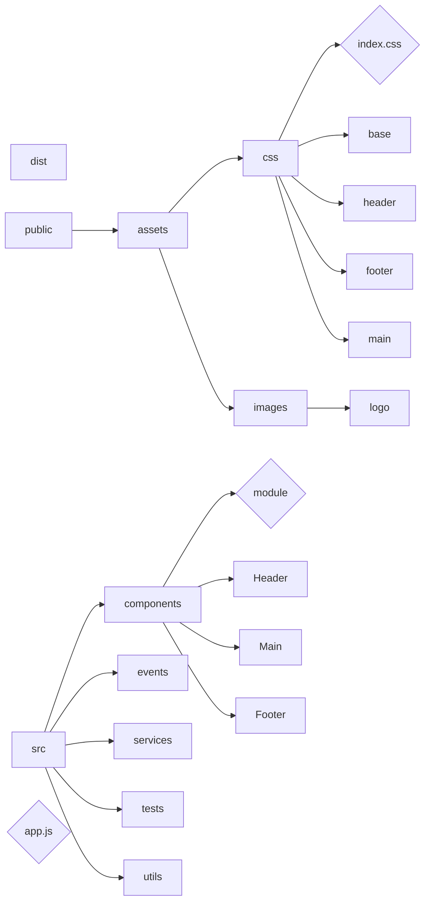

## Body Structure

Layout highly depends on the data fetched by getData.
The component rendering follow json structure. Fully dynamic.

## Folder Project Structure

### Details techniques :

<ul>

<li><strong>"./dist"</strong> : est une copie compilée du projet. Il contient les fichiers JS. Le navigateur se sert de "./dist", pas "./src". C'est le dossier servit au navigateur. Ce n'est pas le dossier de developpement à proprement parlé.</li>

<li><strong>"./public"</strong> : contient les fichiers publiques, que l'utilisateur peut voir en front. Le css dans le dossier "/css" et les images dans "/images". Contient le "./dist" à terme.</li>

<li><strong>"./src/components" </strong>:  Contient le code relatif à un composant réutilisable. Header ect...</li>

<li><strong>"./src/events"</strong> : Contient les scripts liés aux events</li>

<li><strong>"./src/services"</strong> : Contient les scripts lié au requete serveur et les variables lié à ceux ci.</li>

<li><strong>"./src/utils" </strong>: Contient des fichiers de fonctions utilitaires (rajouter des points au milieu d'une chaine de caractères, formater une chaine, verifier une donnée, creer des tableaux ect..)</li>

<li><strong>"./src/tests"</strong> : Contient les scripts de tests et de monitoring des performances</li>

</ul>

### Notes

Le fichiers <strong>index.css</strong> importe TOUS les fichiers css du projets à utiliser sur la page. Le navigateur interprete le fichier index.css :  

> \<link href="./public/assets/index.css" />

Le fichier <strong>Module.js</strong> dans "./components" importe tous les composants à un seul et même endroit.  
Le fichier <strong>"./app.js"</strong> est le point d'entrée du navigateur dans le projet. C'est le fichier principal avec <strong>"./index.html"</strong>.

Les dossiers non-décrit comme "./interface" ou "./types" sont des dossiers lié à mon utilisation de Typescript donc dispensable. Pareil pour les fichiers terminant en .d.ts, .d.js , .d.map.js et enfin .d.map.ts.

